# C# 架构设计

## 设计概述

本文档深入探讨 Unity 中 C# 代码设计的核心理念和实践经验，重点关注代码架构的内功修炼，包括数据容器设计、接口驱动开发、组件化架构等关键方面。通过系统性的设计原则和实战案例，帮助开发者构建高质量、可维护的 Unity 项目。

<!-- more -->

## 核心设计理念

### 数据与行为分离原则

在 Unity 开发中，一个类应该明确其主要职责是作为数据容器还是行为载体。这种分离带来的好处包括：

| 设计模式 | 职责定义 | 优势 | 适用场景 |
|----------|----------|------|----------|
| 数据容器类 | 主要存储状态数据，最小化方法数量 | 序列化友好、易于调试、数据流清晰 | 配置数据、游戏状态、持久化对象 |
| 行为载体类 | 主要包含业务逻辑，通过接口暴露能力 | 职责清晰、易于测试、解耦合度高 | 系统控制器、服务类、管理器 |
| 混合型类 | 数据与行为并重，通过设计平衡两者 | 使用便捷、适合小型项目 | 简单组件、工具类 |

### 接口驱动的架构设计

接口在 Unity 开发中扮演着架构契约的重要角色，通过接口可以快速理解类的能力而无需深入实现细节。

#### 接口设计的核心价值

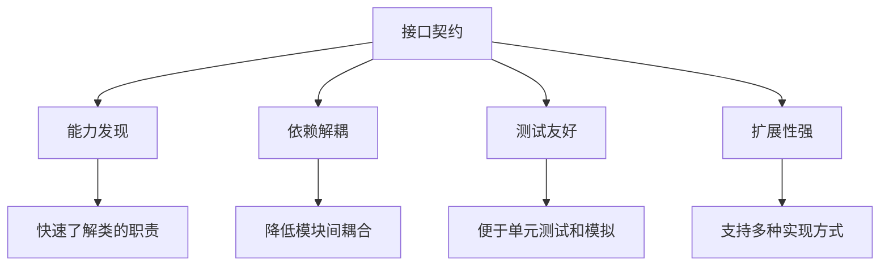

#### 接口分层策略

Unity 项目中的接口设计应该遵循分层架构：

| 接口层级 | 抽象级别 | 设计目标 | 示例 |
|----------|----------|----------|------|
| 核心能力接口 | 高抽象 | 定义基础行为契约 | `IMoveable`, `IDamageable`, `IInteractable` |
| 系统功能接口 | 中抽象 | 定义子系统职责 | `IInventorySystem`, `ISaveSystem`, `IAudioManager` |
| 具体实现接口 | 低抽象 | 定义特定实现细节 | `IWeaponController`, `IPlayerInput`, `IEnemyAI` |

## Unity 组件化架构设计

### 组件化的核心思想

Unity 的 Component 系统天然支持组件化开发，应该充分利用这一特性构建松耦合的架构。

#### 主控制器模式

每个游戏对象应该有一个主要的控制组件，负责协调其他功能组件：

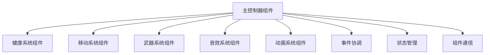

#### 组件职责分工表

| 组件类型 | 职责范围 | 设计特点 | 通信方式 |
|----------|----------|----------|----------|
| 主控制器 | 组件协调、状态管理、事件分发 | 轻量级、接口丰富 | UnityEvent、接口调用 |
| 功能组件 | 单一功能实现、状态维护 | 高内聚、低耦合 | 事件通知、直接调用 |
| 数据组件 | 配置存储、状态持久化 | 序列化友好、只读属性 | 属性访问、配置注入 |
| 服务组件 | 全局服务、跨对象通信 | 单例模式、生命周期管理 | 服务定位、依赖注入 |

### 组件间通信策略

Unity 组件间通信应该遵循清晰的层次结构：

#### 通信方式优先级

1. **接口调用**（推荐）- 强类型、编译时检查
2. **UnityEvent**（适中）- 松耦合、Inspector 可配置
3. **事件系统**（谨慎）- 全局通信、需要良好的事件管理
4. **静态引用**（避免）- 紧耦合、难以测试

## SOLID 原则在 Unity 中的实践

### 单一职责原则（SRP）在组件设计中的应用

#### 组件职责划分矩阵

| 功能领域 | 组件名称 | 核心职责 | 避免职责 |
|----------|----------|----------|----------|
| 生命值管理 | HealthComponent | 血量计算、伤害处理、死亡状态 | UI 更新、音效播放、动画控制 |
| 移动控制 | MovementComponent | 位置变换、速度控制、物理交互 | 输入处理、AI 决策、动画同步 |
| 武器系统 | WeaponComponent | 武器逻辑、射击机制、弹药管理 | 伤害计算、目标搜索、特效播放 |
| 输入处理 | InputComponent | 输入采集、命令转换、输入状态 | 移动执行、技能释放、界面操作 |

### 开闭原则（OCP）在扩展性设计中的体现

#### 策略模式的游戏应用

通过接口和策略模式实现对扩展开放、对修改封闭：

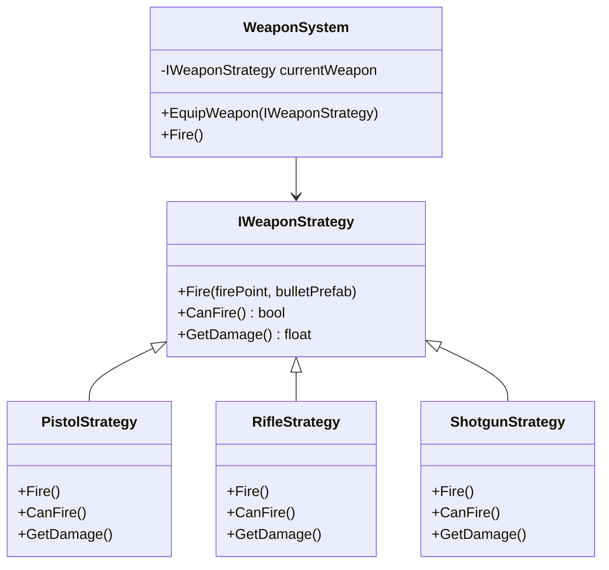

### 依赖倒置原则（DIP）在服务架构中的实现

#### 服务定位器模式

通过抽象接口和服务容器实现依赖倒置：

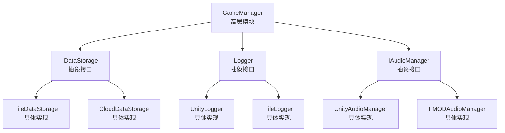

## 数据驱动的架构设计

### ScriptableObject 作为数据容器

#### 数据容器设计原则

1. **纯数据存储** - 最小化方法，专注于数据序列化
2. **配置驱动** - 通过配置文件控制游戏行为
3. **版本兼容** - 考虑数据结构的向后兼容性
4. **类型安全** - 使用强类型而非字符串键值

#### 数据容器分类策略

| 数据类型 | 设计模式 | 序列化方式 | 使用场景 |
|----------|----------|------------|----------|
| 配置数据 | ScriptableObject | Unity 原生序列化 | 游戏平衡性参数、系统配置 |
| 状态数据 | 普通类 + `[Serializable]` | JsonUtility 或第三方 | 存档数据、运行时状态 |
| 临时数据 | 结构体或简单类 | 内存存储 | 帧间传递、计算缓存 |
| 引用数据 | 资源引用 + 配置 | AssetReference | 预制体配置、资源管理 |

### 配置与逻辑分离

#### 数据驱动的武器系统设计

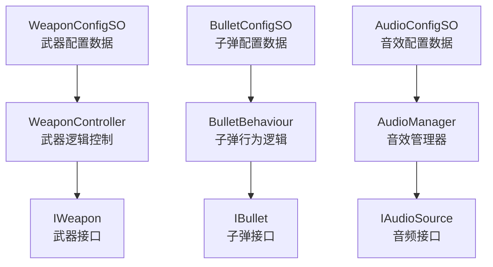

## 事件驱动的通信架构

### 事件系统的层次设计

#### 事件分类与应用场景

| 事件类型 | 作用域 | 生命周期 | 适用场景 |
|----------|--------|----------|----------|
| 本地事件 | 组件内部 | 组件生命周期 | 状态变化通知、内部逻辑处理 |
| 对象事件 | GameObject 范围 | 对象生命周期 | 组件间通信、功能协调 |
| 系统事件 | 场景或全局 | 场景或应用生命周期 | 系统级通知、跨对象通信 |
| 业务事件 | 游戏逻辑 | 游戏会话 | 游戏机制、业务流程 |

#### 事件命名和组织规范

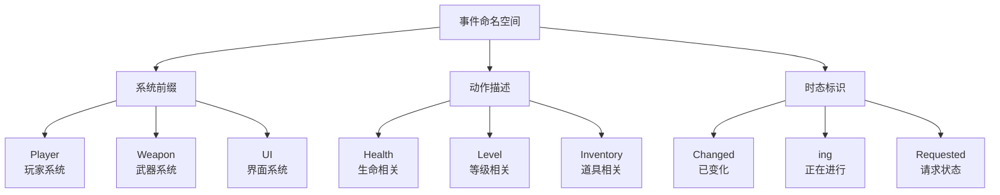

## 性能优化的设计考量

### 对象池模式在 Unity 中的应用

#### 池化策略设计

| 对象类型 | 池化方式 | 池大小策略 | 生命周期管理 |
|----------|----------|------------|--------------|
| 频繁创建对象 | 专用对象池 | 动态扩展 | 引用计数 |
| 相似对象族 | 通用对象池 | 固定大小 | 时间过期 |
| 大型对象 | 懒加载池 | 小容量 | 主动回收 |
| 临时对象 | 栈式池 | 预分配 | 作用域回收 |

### 内存管理和垃圾回收优化

#### GC 友好的代码设计原则

1. **减少装箱拆箱** - 使用泛型而非 object 类型
2. **避免频繁字符串操作** - 使用 StringBuilder 或对象池
3. **缓存频繁计算结果** - 避免每帧重复计算
4. **使用结构体存储简单数据** - 减少堆内存分配
5. **谨慎使用 LINQ** - 在性能关键路径避免使用

## 测试驱动的设计方法

### 可测试性设计原则

#### 测试友好的架构特征

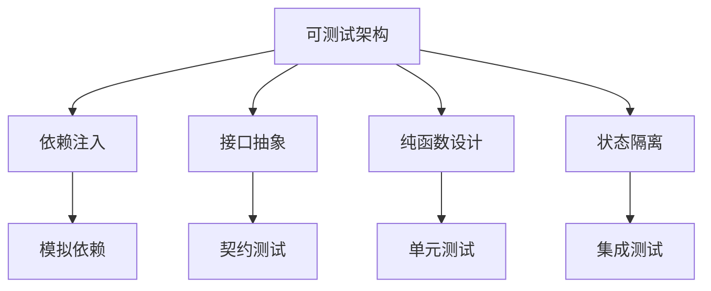

### 测试分层策略

| 测试层级 | 测试对象 | 测试工具 | 测试重点 |
|----------|----------|----------|----------|
| 单元测试 | 单个类或方法 | NUnit + NSubstitute | 逻辑正确性、边界条件 |
| 组件测试 | Unity 组件 | Unity Test Framework | 组件交互、生命周期 |
| 集成测试 | 系统模块 | 自定义测试框架 | 模块协作、数据流 |
| 端到端测试 | 完整功能 | 自动化测试工具 | 用户体验、性能表现 |

## 代码组织和模块化

### 命名空间和程序集设计

#### 模块划分策略

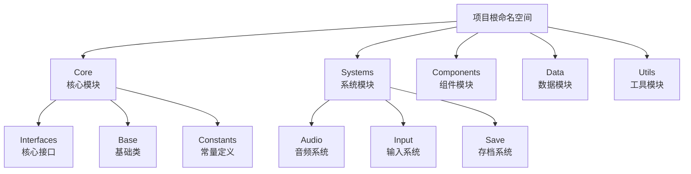

### 文件夹结构和代码组织

#### 推荐的项目结构

| 目录层级 | 组织原则 | 包含内容 | 命名规范 |
|----------|----------|----------|----------|
| 功能模块 | 按业务功能划分 | 相关的类、接口、配置 | 业务名称 + 模块类型 |
| 技术层次 | 按技术职责划分 | 相同抽象级别的代码 | 技术类型 + 功能描述 |
| 生命周期 | 按使用阶段划分 | 相同生命周期的资源 | 阶段名称 + 资源类型 |
| 依赖关系 | 按依赖方向划分 | 低耦合的模块 | 依赖层级 + 功能名称 |

## 版本控制和代码维护

### 重构策略和时机

#### 重构决策矩阵

| 重构类型 | 触发条件 | 重构范围 | 风险评估 |
|----------|----------|----------|----------|
| 结构重构 | 架构腐化、性能问题 | 模块级别 | 高风险、需要充分测试 |
| 功能重构 | 需求变更、设计缺陷 | 功能级别 | 中风险、影响相关功能 |
| 代码重构 | 代码异味、可读性差 | 类或方法级别 | 低风险、局部改进 |
| 性能重构 | 性能瓶颈、资源浪费 | 算法或数据结构 | 中风险、需要性能测试 |

### 代码质量监控

#### 质量指标体系

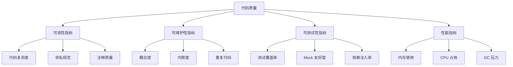

## QFramework 架构设计案例分析

### QFramework 的核心设计理念

QFramework 是一个优秀的 Unity 架构框架，其设计充分体现了本文档所述的各项设计原则。通过分析 QFramework 的架构设计，可以更好地理解 Unity 中 C# 代码设计的最佳实践。

#### QFramework 四层架构模型

QFramework 采用了清晰的分层架构，完美诠释了职责分离和依赖管理的重要性：

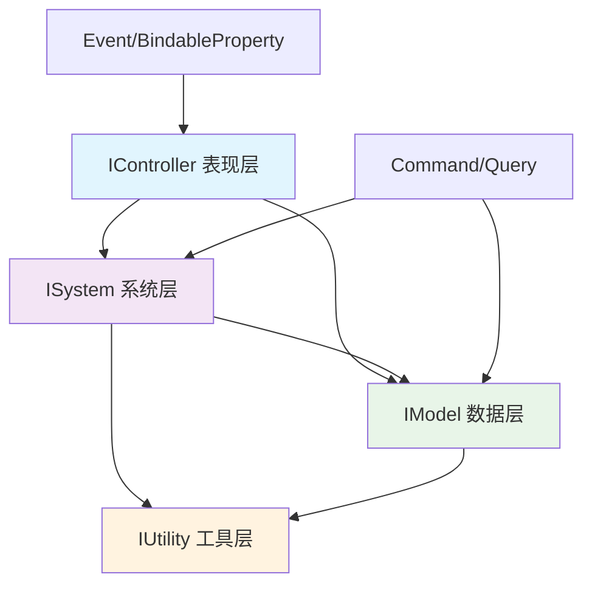

| 层级 | 职责 | 依赖关系 | 通信方式 |
|------|------|----------|----------|
| IController (表现层) | 接收输入、状态表现、UI 控制 | 可获取 System、Model | 发送 Command/Query，监听 Event |
| ISystem (系统层) | 业务逻辑、跨 Controller 共享逻辑 | 可获取 System、Model、Utility | 监听/发送 Event |
| IModel (数据层) | 数据存储、数据操作 | 可获取 Utility | 发送 Event |
| IUtility (工具层) | 基础设施、第三方封装 | 无依赖 | 纯工具方法 |

### QFramework 中的 SOLID 原则实践

#### 单一职责原则的体现

QFramework 通过分层设计确保每个层级都有明确的职责：

```csharp
// ✅ 数据层：只负责数据管理
public interface ICounterModel : IModel
{
    BindableProperty<int> Count { get; }
    void IncrementCount();
    void DecrementCount();
}

// ✅ 系统层：只负责业务逻辑
public interface ICounterSystem : ISystem
{
    void ProcessCounterLogic();
    bool CanIncrement();
}

// ✅ 表现层：只负责 UI 表现
public class CounterController : MonoBehaviour, IController
{
    [SerializeField] private Button incrementBtn;
    [SerializeField] private Button decrementBtn;
    [SerializeField] private Text countText;
    
    private ICounterModel counterModel;
    
    void Start()
    {
        counterModel = this.GetModel<ICounterModel>();
        
        // 数据绑定
        counterModel.Count.RegisterWithInitValue(OnCountChanged);
        
        // 事件绑定
        incrementBtn.onClick.AddListener(() => 
        {
            this.SendCommand<IncrementCountCommand>();
        });
    }
    
    void OnCountChanged(int newCount)
    {
        countText.text = newCount.ToString();
    }
    
    public IArchitecture GetArchitecture() => CounterApp.Interface;
}
```

#### 开闭原则的实现

QFramework 通过接口和 Command 模式实现对扩展开放、对修改封闭：

```csharp
// ✅ Command 模式：新增功能无需修改现有代码
public class IncrementCountCommand : AbstractCommand
{
    protected override void OnExecute()
    {
        var model = this.GetModel<ICounterModel>();
        var system = this.GetSystem<ICounterSystem>();
        
        if (system.CanIncrement())
        {
            model.IncrementCount();
        }
    }
}

// 添加新功能：批量增加
public class BatchIncrementCommand : AbstractCommand
{
    private int amount;
    
    public BatchIncrementCommand(int amount)
    {
        this.amount = amount;
    }
    
    protected override void OnExecute()
    {
        for (int i = 0; i < amount; i++)
        {
            this.SendCommand<IncrementCountCommand>();
        }
    }
}
```

#### 依赖倒置原则的应用

QFramework 通过 Architecture 模式和接口实现依赖倒置：

```csharp
// ✅ Architecture 作为依赖注入容器
public class CounterApp : Architecture<CounterApp>
{
    protected override void Init()
    {
        // 注册 Model
        this.RegisterModel<ICounterModel>(new CounterModel());
        
        // 注册 System
        this.RegisterSystem<ICounterSystem>(new CounterSystem());
        
        // 注册 Utility
        this.RegisterUtility<IStorageUtility>(new PlayerPrefsStorage());
    }
}

// ✅ 高层模块不依赖具体实现
public class CounterModel : AbstractModel, ICounterModel
{
    public BindableProperty<int> Count { get; private set; }
    
    protected override void OnInit()
    {
        var storage = this.GetUtility<IStorageUtility>();
        var savedCount = storage.LoadInt("counter", 0);
        Count = new BindableProperty<int>(savedCount);
        
        Count.Register(count => 
        {
            storage.SaveInt("counter", count);
        });
    }
    
    public void IncrementCount()
    {
        Count.Value++;
        this.SendEvent<CountChangedEvent>(new CountChangedEvent(Count.Value));
    }
}
```

### QFramework 的事件驱动设计

#### 类型安全的事件系统

QFramework 提供了类型安全的事件系统，避免了字符串事件的弊端：

```csharp
// ✅ 类型安全的事件定义
public struct CountChangedEvent
{
    public int NewCount { get; }
    
    public CountChangedEvent(int newCount)
    {
        NewCount = newCount;
    }
}

// ✅ 事件的发送和监听
public class CounterModel : AbstractModel, ICounterModel
{
    public void IncrementCount()
    {
        Count.Value++;
        // 发送强类型事件
        this.SendEvent<CountChangedEvent>(new CountChangedEvent(Count.Value));
    }
}

public class AchievementSystem : AbstractSystem, IAchievementSystem
{
    protected override void OnInit()
    {
        // 监听强类型事件
        this.RegisterEvent<CountChangedEvent>(OnCountChanged);
    }
    
    private void OnCountChanged(CountChangedEvent e)
    {
        if (e.NewCount >= 100)
        {
            UnlockAchievement("Master Counter");
        }
    }
}
```

#### BindableProperty 的数据绑定

QFramework 的 BindableProperty 提供了响应式的数据绑定机制：

```csharp
// ✅ 响应式数据绑定
public class PlayerHealthUI : MonoBehaviour, IController
{
    [SerializeField] private Slider healthSlider;
    [SerializeField] private Text healthText;
    
    private IPlayerModel playerModel;
    
    void Start()
    {
        playerModel = this.GetModel<IPlayerModel>();
        
        // 数据绑定：自动同步 UI
        playerModel.Health.RegisterWithInitValue(health => 
        {
            healthSlider.value = health / playerModel.MaxHealth.Value;
            healthText.text = $"{health}/{playerModel.MaxHealth.Value}";
        }).UnRegisterWhenGameObjectDestroyed(gameObject);
        
        // 多个属性组合绑定
        playerModel.Health.CombineLatest(playerModel.MaxHealth, (h, max) => 
        {
            return new { Health = h, MaxHealth = max };
        }).Register(data => 
        {
            healthSlider.value = (float)data.Health / data.MaxHealth;
            healthText.text = $"{data.Health}/{data.MaxHealth}";
        }).UnRegisterWhenGameObjectDestroyed(gameObject);
    }
    
    public IArchitecture GetArchitecture() => GameApp.Interface;
}
```

### QFramework 模块化设计实践

#### 可插拔的模块系统

QFramework 支持模块化的系统设计，每个系统都可以独立开发和测试：

```csharp
// ✅ 模块化的系统设计
public interface IInventorySystem : ISystem
{
    void AddItem(string itemId, int count);
    void RemoveItem(string itemId, int count);
    int GetItemCount(string itemId);
    event System.Action<string, int> OnItemAdded;
    event System.Action<string, int> OnItemRemoved;
}

public class InventorySystem : AbstractSystem, IInventorySystem
{
    private Dictionary<string, int> items = new Dictionary<string, int>();
    
    public event System.Action<string, int> OnItemAdded;
    public event System.Action<string, int> OnItemRemoved;
    
    protected override void OnInit()
    {
        // 从存储中加载物品数据
        var storage = this.GetUtility<IStorageUtility>();
        LoadItemsFromStorage(storage);
    }
    
    public void AddItem(string itemId, int count)
    {
        if (!items.ContainsKey(itemId))
            items[itemId] = 0;
            
        items[itemId] += count;
        OnItemAdded?.Invoke(itemId, count);
        
        // 发送事件给其他系统
        this.SendEvent<ItemAddedEvent>(new ItemAddedEvent(itemId, count));
    }
    
    // ... 其他方法实现
}

// ✅ 系统间的协作
public class ShopSystem : AbstractSystem, IShopSystem
{
    protected override void OnInit()
    {
        // 监听库存变化
        this.RegisterEvent<ItemAddedEvent>(OnItemAdded);
    }
    
    private void OnItemAdded(ItemAddedEvent e)
    {
        // 检查是否解锁新商品
        CheckUnlockNewItems(e.ItemId);
    }
    
    public bool PurchaseItem(string itemId, int price)
    {
        var playerModel = this.GetModel<IPlayerModel>();
        var inventorySystem = this.GetSystem<IInventorySystem>();
        
        if (playerModel.Coins.Value >= price)
        {
            // 通过 Command 执行购买逻辑
            this.SendCommand<PurchaseItemCommand>(new PurchaseItemCommand(itemId, price));
            return true;
        }
        
        return false;
    }
}
```

### QFramework 设计模式的应用

#### Command 模式的深度应用

QFramework 的 Command 不仅仅是简单的命令模式，还支持撤销、重做等高级功能：

```csharp
// ✅ 支持撤销的 Command
public interface IUndoableCommand : ICommand
{
    void Undo();
    bool CanUndo { get; }
}

public class MovePlayerCommand : AbstractCommand, IUndoableCommand
{
    private Vector3 fromPosition;
    private Vector3 toPosition;
    private Transform playerTransform;
    
    public bool CanUndo => true;
    
    public MovePlayerCommand(Vector3 to)
    {
        toPosition = to;
    }
    
    protected override void OnExecute()
    {
        var playerModel = this.GetModel<IPlayerModel>();
        playerTransform = playerModel.PlayerTransform;
        fromPosition = playerTransform.position;
        
        playerTransform.position = toPosition;
        playerModel.Position.Value = toPosition;
    }
    
    public void Undo()
    {
        if (playerTransform != null)
        {
            playerTransform.position = fromPosition;
            var playerModel = this.GetModel<IPlayerModel>();
            playerModel.Position.Value = fromPosition;
        }
    }
}

// ✅ Command 历史管理
public class CommandHistory : IUtility
{
    private Stack<IUndoableCommand> undoStack = new Stack<IUndoableCommand>();
    private Stack<IUndoableCommand> redoStack = new Stack<IUndoableCommand>();
    
    public void ExecuteCommand(IUndoableCommand command)
    {
        command.Execute();
        undoStack.Push(command);
        redoStack.Clear(); // 执行新命令时清空重做栈
    }
    
    public bool CanUndo => undoStack.Count > 0;
    public bool CanRedo => redoStack.Count > 0;
    
    public void Undo()
    {
        if (CanUndo)
        {
            var command = undoStack.Pop();
            command.Undo();
            redoStack.Push(command);
        }
    }
    
    public void Redo()
    {
        if (CanRedo)
        {
            var command = redoStack.Pop();
            command.Execute();
            undoStack.Push(command);
        }
    }
}
```

#### 组合模式在 QFramework 中的应用

QFramework 支持 Command 的组合，可以构建复杂的命令序列：

```csharp
// ✅ 复合 Command
public class CompositeCommand : AbstractCommand
{
    private List<ICommand> commands = new List<ICommand>();
    
    public CompositeCommand Add(ICommand command)
    {
        commands.Add(command);
        return this;
    }
    
    protected override void OnExecute()
    {
        foreach (var command in commands)
        {
            command.Execute();
        }
    }
}

// 使用示例：玩家升级的复合操作
public class PlayerLevelUpCommand : AbstractCommand
{
    protected override void OnExecute()
    {
        var compositeCommand = new CompositeCommand()
            .Add(new IncreaseLevelCommand())
            .Add(new AddAttributePointsCommand(5))
            .Add(new PlayLevelUpEffectCommand())
            .Add(new SavePlayerDataCommand());
            
        compositeCommand.Execute();
    }
}
```

### QFramework 的性能优化设计

#### 对象池在 QFramework 中的应用

QFramework 内置了对象池机制，减少 GC 压力：

```csharp
// ✅ QFramework 的对象池设计
public class PoolableCommand : AbstractCommand, IPoolable
{
    private bool isRecycled = false;
    
    public bool IsRecycled { get => isRecycled; set => isRecycled = value; }
    
    protected override void OnExecute()
    {
        // 执行命令逻辑
        DoExecute();
        
        // 自动回收到对象池
        this.Recycle2Cache();
    }
    
    protected virtual void DoExecute() { }
    
    public void OnRecycled()
    {
        // 重置状态
        ResetState();
    }
    
    protected virtual void ResetState() { }
}

// 使用对象池的 Command
public class DamageCommand : PoolableCommand
{
    private GameObject target;
    private float damage;
    
    public static DamageCommand Allocate(GameObject target, float damage)
    {
        var command = SafeObjectPool<DamageCommand>.Instance.Allocate();
        command.target = target;
        command.damage = damage;
        return command;
    }
    
    protected override void DoExecute()
    {
        var health = target.GetComponent<HealthComponent>();
        health?.TakeDamage(damage);
    }
    
    protected override void ResetState()
    {
        target = null;
        damage = 0;
    }
}
```

## 实践建议和经验总结

### 渐进式架构演进

#### QFramework 渐进式引入策略

QFramework 的一个突出优势是支持渐进式引入，不需要一次性重构整个项目：

| 引入阶段 | 引入内容 | 改动成本 | 获得效益 |
|----------|----------|----------|----------|
| 第一阶段 | BindableProperty + 事件系统 | 小 | 数据绑定、响应式 UI |
| 第二阶段 | IModel + IController | 中 | 数据层分离、架构清晰 |
| 第三阶段 | Command 模式 | 中 | 交互逻辑解耦、可撤销操作 |
| 第四阶段 | ISystem + 全套架构 | 大 | 完整架构体系、模块化开发 |

```csharp
// ✅ 阶段一：只使用 BindableProperty
public class SimpleCounterController : MonoBehaviour
{
    [SerializeField] private Button incrementBtn;
    [SerializeField] private Text countText;
    
    // 直接使用 BindableProperty，无需架构
    private BindableProperty<int> count = new BindableProperty<int>(0);
    
    void Start()
    {
        // 数据绑定
        count.RegisterWithInitValue(value => 
        {
            countText.text = value.ToString();
        });
        
        incrementBtn.onClick.AddListener(() => 
        {
            count.Value++;
        });
    }
}

// ✅ 阶段二：引入 Model 和 Controller
public class CounterModel
{
    public BindableProperty<int> Count { get; } = new BindableProperty<int>(0);
    
    public void Increment() => Count.Value++;
    public void Decrement() => Count.Value--;
}

public class CounterController : MonoBehaviour
{
    [SerializeField] private Button incrementBtn;
    [SerializeField] private Button decrementBtn;
    [SerializeField] private Text countText;
    
    private CounterModel model;
    
    void Start()
    {
        model = new CounterModel();
        
        model.Count.RegisterWithInitValue(OnCountChanged);
        
        incrementBtn.onClick.AddListener(model.Increment);
        decrementBtn.onClick.AddListener(model.Decrement);
    }
    
    void OnCountChanged(int newCount)
    {
        countText.text = newCount.ToString();
    }
}
```

### QFramework 在大型项目中的应用案例

#### 复杂游戏系统架构设计

以一个 RPG 游戏为例，展示 QFramework 如何支持复杂的游戏系统：

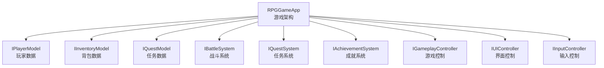

```csharp
// ✅ RPG 游戏的模块化架构
public class RPGGameApp : Architecture<RPGGameApp>
{
    protected override void Init()
    {
        // 数据层
        this.RegisterModel<IPlayerModel>(new PlayerModel());
        this.RegisterModel<IInventoryModel>(new InventoryModel());
        this.RegisterModel<IQuestModel>(new QuestModel());
        this.RegisterModel<ISkillModel>(new SkillModel());
        
        // 系统层
        this.RegisterSystem<IBattleSystem>(new BattleSystem());
        this.RegisterSystem<IQuestSystem>(new QuestSystem());
        this.RegisterSystem<IAchievementSystem>(new AchievementSystem());
        this.RegisterSystem<ISaveSystem>(new SaveSystem());
        
        // 工具层
        this.RegisterUtility<IStorageUtility>(new JsonStorageUtility());
        this.RegisterUtility<ITimeUtility>(new UnityTimeUtility());
        this.RegisterUtility<IRandomUtility>(new SystemRandomUtility());
    }
}

// ✅ 系统间的协作示例：战斗系统
public class BattleSystem : AbstractSystem, IBattleSystem
{
    private IPlayerModel playerModel;
    private IInventoryModel inventoryModel;
    private IQuestSystem questSystem;
    
    protected override void OnInit()
    {
        playerModel = this.GetModel<IPlayerModel>();
        inventoryModel = this.GetModel<IInventoryModel>();
        questSystem = this.GetSystem<IQuestSystem>();
        
        // 监听敌人死亡事件
        this.RegisterEvent<EnemyDefeatedEvent>(OnEnemyDefeated);
    }
    
    public void AttackEnemy(EnemyData enemy)
    {
        var damage = CalculateDamage(playerModel, enemy);
        
        // 执行攻击命令
        this.SendCommand<DealDamageCommand>(new DealDamageCommand(enemy, damage));
    }
    
    private void OnEnemyDefeated(EnemyDefeatedEvent e)
    {
        // 获得经验值
        var expGained = e.Enemy.ExperienceReward;
        this.SendCommand<GainExperienceCommand>(new GainExperienceCommand(expGained));
        
        // 获得战利品
        var loot = GenerateLoot(e.Enemy);
        foreach (var item in loot)
        {
            this.SendCommand<AddItemCommand>(new AddItemCommand(item.Id, item.Quantity));
        }
        
        // 通知任务系统
        questSystem.OnEnemyKilled(e.Enemy.Type);
    }
    
    private float CalculateDamage(IPlayerModel player, EnemyData enemy)
    {
        var baseDamage = player.Attack.Value;
        var weaponDamage = GetEquippedWeaponDamage();
        var skillMultiplier = GetSkillMultiplier();
        
        return (baseDamage + weaponDamage) * skillMultiplier;
    }
}
```

#### 复杂 UI 系统的架构设计

QFramework 在 UI 系统中的应用展示了其在复杂界面管理中的优势：

```csharp
// ✅ 数据驱动的 UI 设计
public class InventoryPanel : UIPanel, IController
{
    [Header("UI 引用")]
    [SerializeField] private Transform itemContainer;
    [SerializeField] private InventoryItemView itemPrefab;
    [SerializeField] private Button sortButton;
    [SerializeField] private Text capacityText;
    
    private IInventoryModel inventoryModel;
    private List<InventoryItemView> itemViews = new List<InventoryItemView>();
    
    void Start()
    {
        inventoryModel = this.GetModel<IInventoryModel>();
        
        // 监听数据变化
        inventoryModel.Items.RegisterWithInitValue(OnItemsChanged)
            .UnRegisterWhenGameObjectDestroyed(gameObject);
            
        inventoryModel.Capacity.RegisterWithInitValue(OnCapacityChanged)
            .UnRegisterWhenGameObjectDestroyed(gameObject);
        
        // UI 事件绑定
        sortButton.onClick.AddListener(() => 
        {
            this.SendCommand<SortInventoryCommand>();
        });
        
        // 监听物品变化事件
        this.RegisterEvent<ItemUsedEvent>(OnItemUsed);
    }
    
    private void OnItemsChanged(List<ItemData> items)
    {
        // 清理旧的 UI
        foreach (var view in itemViews)
        {
            if (view != null)
                Destroy(view.gameObject);
        }
        itemViews.Clear();
        
        // 创建新的 UI
        foreach (var item in items)
        {
            var itemView = Instantiate(itemPrefab, itemContainer);
            itemView.SetData(item);
            itemView.OnItemClicked += (clickedItem) => 
            {
                this.SendCommand<UseItemCommand>(new UseItemCommand(clickedItem.Id));
            };
            itemViews.Add(itemView);
        }
    }
    
    private void OnCapacityChanged(int capacity)
    {
        var currentCount = inventoryModel.Items.Value.Count;
        capacityText.text = $"{currentCount}/{capacity}";
        
        // 容量警告
        if (currentCount >= capacity * 0.9f)
        {
            capacityText.color = Color.red;
        }
        else if (currentCount >= capacity * 0.7f)
        {
            capacityText.color = Color.yellow;
        }
        else
        {
            capacityText.color = Color.white;
        }
    }
    
    private void OnItemUsed(ItemUsedEvent e)
    {
        // 播放使用物品的特效
        PlayItemUseEffect(e.ItemId);
    }
    
    public IArchitecture GetArchitecture() => RPGGameApp.Interface;
}

// ✅ 可复用的物品视图组件
public class InventoryItemView : MonoBehaviour
{
    [SerializeField] private Image iconImage;
    [SerializeField] private Text nameText;
    [SerializeField] private Text quantityText;
    [SerializeField] private Button useButton;
    
    public event System.Action<ItemData> OnItemClicked;
    
    private ItemData itemData;
    
    void Start()
    {
        useButton.onClick.AddListener(() => 
        {
            OnItemClicked?.Invoke(itemData);
        });
    }
    
    public void SetData(ItemData data)
    {
        itemData = data;
        iconImage.sprite = data.Icon;
        nameText.text = data.Name;
        quantityText.text = data.Quantity > 1 ? data.Quantity.ToString() : "";
        
        // 根据物品类型设置不同的显示状态
        useButton.interactable = data.IsUsable;
    }
}
```

### QFramework 的性能优化最佳实践

#### 事件系统的性能优化

QFramework 的事件系统在大量事件监听和发送时的性能优化：

```csharp
// ✅ 优化的事件处理
public class OptimizedEventSystem : MonoBehaviour
{
    // 使用对象池减少 GC
    private static readonly ObjectPool<List<System.Action>> ActionListPool = 
        new ObjectPool<List<System.Action>>(() => new List<System.Action>(), null, l => l.Clear());
    
    void Start()
    {
        // 批量事件处理
        var actions = ActionListPool.Get();
        
        // 收集所有需要执行的事件
        CollectPendingEvents(actions);
        
        // 批量执行
        foreach (var action in actions)
        {
            action?.Invoke();
        }
        
        // 回收对象
        ActionListPool.Release(actions);
    }
    
    // ✅ 按需加载的事件监听
    private readonly Dictionary<System.Type, bool> eventSubscriptions = new Dictionary<System.Type, bool>();
    
    private void RegisterEventOnDemand<T>(System.Action<T> handler) where T : struct
    {
        var eventType = typeof(T);
        
        if (!eventSubscriptions.ContainsKey(eventType))
        {
            this.RegisterEvent<T>(handler);
            eventSubscriptions[eventType] = true;
        }
    }
    
    // ✅ 按区域的事件管理
    public class RegionalEventManager : IUtility
    {
        private readonly Dictionary<string, HashSet<IController>> regionControllers = new Dictionary<string, HashSet<IController>>();
        
        public void RegisterControllerToRegion(string region, IController controller)
        {
            if (!regionControllers.ContainsKey(region))
                regionControllers[region] = new HashSet<IController>();
                
            regionControllers[region].Add(controller);
        }
        
        public void SendEventToRegion<T>(string region, T eventData) where T : struct
        {
            if (regionControllers.TryGetValue(region, out var controllers))
            {
                foreach (var controller in controllers)
                {
                    // 只向特定区域的控制器发送事件
                    if (controller is MonoBehaviour mb && mb != null)
                    {
                        // 发送事件的逻辑
                    }
                }
            }
        }
    }
}
```

#### 内存管理的最佳实践

```csharp
// ✅ QFramework 中的内存优化技巧
public class MemoryOptimizedModel : AbstractModel, IDisposable
{
    // 使用结构体减少堆内存分配
    public struct PlayerState
    {
        public int Health;
        public int Mana;
        public Vector3 Position;
        public bool IsAlive;
    }
    
    private readonly BindableProperty<PlayerState> playerState = new BindableProperty<PlayerState>();
    
    // 缓存频繁计算的结果
    private readonly Dictionary<string, float> cachedCalculations = new Dictionary<string, float>();
    private float lastCalculationTime;
    
    public float GetDamageMultiplier()
    {
        const string cacheKey = "damageMultiplier";
        
        // 缓存 1 秒钟内的计算结果
        if (Time.time - lastCalculationTime < 1f && cachedCalculations.ContainsKey(cacheKey))
        {
            return cachedCalculations[cacheKey];
        }
        
        var multiplier = CalculateDamageMultiplier();
        cachedCalculations[cacheKey] = multiplier;
        lastCalculationTime = Time.time;
        
        return multiplier;
    }
    
    private float CalculateDamageMultiplier()
    {
        // 复杂的计算逻辑
        return 1.0f;
    }
    
    public void Dispose()
    {
        cachedCalculations.Clear();
        playerState?.Dispose();
    }
}

// ✅ 懒加载的数据管理
public class LazyLoadedDataModel : AbstractModel
{
    private readonly Dictionary<string, WeakReference> dataCache = new Dictionary<string, WeakReference>();
    
    public T GetData<T>(string key, System.Func<T> factory) where T : class
    {
        if (dataCache.TryGetValue(key, out var weakRef) && weakRef.IsAlive)
        {
            return weakRef.Target as T;
        }
        
        var data = factory();
        dataCache[key] = new WeakReference(data);
        return data;
    }
    
    // 定期清理已经被 GC 的弱引用
    public void CleanupWeakReferences()
    {
        var keysToRemove = new List<string>();
        
        foreach (var kvp in dataCache)
        {
            if (!kvp.Value.IsAlive)
            {
                keysToRemove.Add(kvp.Key);
            }
        }
        
        foreach (var key in keysToRemove)
        {
            dataCache.Remove(key);
        }
    }
}
```

### QFramework 的测试和调试最佳实践

#### 可测试性设计

QFramework 的分层架构天然支持单元测试和集成测试：

```csharp
// ✅ Model 层的单元测试
[TestFixture]
public class CounterModelTests
{
    private CounterModel model;
    private TestArchitecture architecture;
    
    [SetUp]
    public void Setup()
    {
        architecture = new TestArchitecture();
        model = new CounterModel();
        model.SetArchitecture(architecture);
        model.Init();
    }
    
    [Test]
    public void IncrementCount_ShouldIncreaseByOne()
    {
        // Arrange
        var initialCount = model.Count.Value;
        
        // Act
        model.IncrementCount();
        
        // Assert
        Assert.AreEqual(initialCount + 1, model.Count.Value);
    }
    
    [Test]
    public void IncrementCount_ShouldSendEvent()
    {
        // Arrange
        bool eventReceived = false;
        CountChangedEvent receivedEvent = default;
        
        architecture.RegisterEvent<CountChangedEvent>(e => 
        {
            eventReceived = true;
            receivedEvent = e;
        });
        
        // Act
        model.IncrementCount();
        
        // Assert
        Assert.IsTrue(eventReceived);
        Assert.AreEqual(model.Count.Value, receivedEvent.NewCount);
    }
    
    [TearDown]
    public void TearDown()
    {
        model = null;
        architecture.Deinit();
    }
}

// ✅ 测试用的模拟架构
public class TestArchitecture : IArchitecture
{
    private readonly Dictionary<Type, object> models = new Dictionary<Type, object>();
    private readonly Dictionary<Type, object> systems = new Dictionary<Type, object>();
    private readonly Dictionary<Type, object> utilities = new Dictionary<Type, object>();
    
    public T GetModel<T>() where T : class, IModel
    {
        return models.TryGetValue(typeof(T), out var model) ? model as T : null;
    }
    
    public T GetSystem<T>() where T : class, ISystem
    {
        return systems.TryGetValue(typeof(T), out var system) ? system as T : null;
    }
    
    public T GetUtility<T>() where T : class, IUtility
    {
        return utilities.TryGetValue(typeof(T), out var utility) ? utility as T : null;
    }
    
    public void RegisterModel<T>(T model) where T : class, IModel
    {
        models[typeof(T)] = model;
    }
    
    public void RegisterSystem<T>(T system) where T : class, ISystem
    {
        systems[typeof(T)] = system;
    }
    
    public void RegisterUtility<T>(T utility) where T : class, IUtility
    {
        utilities[typeof(T)] = utility;
    }
    
    public void SendCommand<T>() where T : ICommand, new()
    {
        var command = new T();
        command.SetArchitecture(this);
        command.Execute();
    }
    
    public void SendCommand<T>(T command) where T : ICommand
    {
        command.SetArchitecture(this);
        command.Execute();
    }
    
    public void RegisterEvent<T>(Action<T> onEvent)
    {
        // 测试事件注册逻辑
    }
    
    public void UnRegisterEvent<T>(Action<T> onEvent)
    {
        // 测试事件取消注册逻辑
    }
    
    public void SendEvent<T>(T e)
    {
        // 测试事件发送逻辑
    }
    
    public void Deinit()
    {
        models.Clear();
        systems.Clear();
        utilities.Clear();
    }
}
```

#### Command 的集成测试

```csharp
// ✅ Command 的集成测试
[TestFixture]
public class PurchaseItemCommandTests
{
    private TestArchitecture architecture;
    private IPlayerModel playerModel;
    private IInventoryModel inventoryModel;
    private IShopSystem shopSystem;
    
    [SetUp]
    public void Setup()
    {
        architecture = new TestArchitecture();
        
        // 模拟依赖
        playerModel = new MockPlayerModel();
        inventoryModel = new MockInventoryModel();
        shopSystem = new MockShopSystem();
        
        architecture.RegisterModel<IPlayerModel>(playerModel);
        architecture.RegisterModel<IInventoryModel>(inventoryModel);
        architecture.RegisterSystem<IShopSystem>(shopSystem);
    }
    
    [Test]
    public void PurchaseItem_WithSufficientCoins_ShouldSucceed()
    {
        // Arrange
        playerModel.Coins.Value = 100;
        var itemId = "sword";
        var price = 50;
        var command = new PurchaseItemCommand(itemId, price);
        
        // Act
        architecture.SendCommand(command);
        
        // Assert
        Assert.AreEqual(50, playerModel.Coins.Value);
        Assert.IsTrue(inventoryModel.HasItem(itemId));
    }
    
    [Test]
    public void PurchaseItem_WithInsufficientCoins_ShouldFail()
    {
        // Arrange
        playerModel.Coins.Value = 30;
        var itemId = "sword";
        var price = 50;
        var command = new PurchaseItemCommand(itemId, price);
        
        // Act & Assert
        Assert.Throws<InsufficientCoinsException>(() => 
        {
            architecture.SendCommand(command);
        });
        
        Assert.AreEqual(30, playerModel.Coins.Value);
        Assert.IsFalse(inventoryModel.HasItem(itemId));
    }
}

// ✅ Mock 对象的实现
public class MockPlayerModel : IPlayerModel
{
    public BindableProperty<int> Coins { get; } = new BindableProperty<int>(0);
    public BindableProperty<int> Level { get; } = new BindableProperty<int>(1);
    
    public void Init() { }
    public IArchitecture GetArchitecture() => null;
    public void SetArchitecture(IArchitecture architecture) { }
}

public class MockInventoryModel : IInventoryModel
{
    private readonly Dictionary<string, int> items = new Dictionary<string, int>();
    
    public void AddItem(string itemId, int quantity)
    {
        if (!items.ContainsKey(itemId))
            items[itemId] = 0;
        items[itemId] += quantity;
    }
    
    public bool HasItem(string itemId)
    {
        return items.ContainsKey(itemId) && items[itemId] > 0;
    }
    
    public void Init() { }
    public IArchitecture GetArchitecture() => null;
    public void SetArchitecture(IArchitecture architecture) { }
}
```

#### 运行时调试工具

QFramework 可以集成强大的运行时调试工具：

```csharp
// ✅ 运行时架构监控器
public class ArchitectureDebugger : MonoBehaviour
{
    [Header("架构调试信息")]
    [SerializeField] private bool showDebugInfo = true;
    [SerializeField] private KeyCode debugToggleKey = KeyCode.F1;
    
    private IArchitecture architecture;
    private readonly List<string> commandHistory = new List<string>();
    private readonly List<string> eventHistory = new List<string>();
    
    void Start()
    {
        architecture = GameApp.Interface;
        
        if (showDebugInfo)
        {
            // 监控所有 Command 执行
            HookCommandExecution();
            
            // 监控所有 Event 发送
            HookEventSending();
        }
    }
    
    void Update()
    {
        if (Input.GetKeyDown(debugToggleKey))
        {
            showDebugInfo = !showDebugInfo;
        }
    }
    
    void OnGUI()
    {
        if (!showDebugInfo) return;
        
        GUILayout.BeginArea(new Rect(10, 10, 400, Screen.height - 20));
        
        GUILayout.Label("QFramework 架构调试器", EditorStyles.boldLabel);
        
        // 显示最近的 Command 历史
        GUILayout.Label("Command 历史:");
        GUILayout.BeginScrollView(Vector2.zero, GUILayout.Height(150));
        foreach (var command in commandHistory.TakeLast(10))
        {
            GUILayout.Label(command);
        }
        GUILayout.EndScrollView();
        
        // 显示最近的 Event 历史
        GUILayout.Label("Event 历史:");
        GUILayout.BeginScrollView(Vector2.zero, GUILayout.Height(150));
        foreach (var evt in eventHistory.TakeLast(10))
        {
            GUILayout.Label(evt);
        }
        GUILayout.EndScrollView();
        
        // 架构状态信息
        GUILayout.Label("Model 状态:");
        DisplayModelStates();
        
        GUILayout.EndArea();
    }
    
    private void HookCommandExecution()
    {
        // 使用反射或 AOP 技术监控 Command 执行
        // 这里简化处理
    }
    
    private void HookEventSending()
    {
        // 使用反射或 AOP 技术监控 Event 发送
        // 这里简化处理
    }
    
    private void DisplayModelStates()
    {
        // 显示各个 Model 的当前状态
        if (architecture.GetModel<IPlayerModel>() is PlayerModel playerModel)
        {
            GUILayout.Label($"玩家等级: {playerModel.Level.Value}");
            GUILayout.Label($"玩家金币: {playerModel.Coins.Value}");
        }
        
        if (architecture.GetModel<IInventoryModel>() is InventoryModel inventoryModel)
        {
            GUILayout.Label($"背包物品数: {inventoryModel.Items.Value.Count}");
        }
    }
}

// ✅ 性能监控器
public class PerformanceMonitor : MonoBehaviour
{
    [Header("性能监控")]
    [SerializeField] private bool enableProfiling = true;
    
    private readonly Dictionary<string, float> commandExecutionTimes = new Dictionary<string, float>();
    private readonly Dictionary<string, int> commandExecutionCounts = new Dictionary<string, int>();
    
    public void LogCommandExecution(string commandName, float executionTime)
    {
        if (!enableProfiling) return;
        
        if (!commandExecutionTimes.ContainsKey(commandName))
        {
            commandExecutionTimes[commandName] = 0;
            commandExecutionCounts[commandName] = 0;
        }
        
        commandExecutionTimes[commandName] += executionTime;
        commandExecutionCounts[commandName]++;
        
        // 发现性能问题时警告
        if (executionTime > 0.1f) // 100ms
        {
            Debug.LogWarning($"Command {commandName} 执行耗时过长: {executionTime:F3}s");
        }
    }
    
    public void PrintPerformanceReport()
    {
        Debug.Log("=== QFramework 性能报告 ===");
        
        foreach (var kvp in commandExecutionTimes)
        {
            var commandName = kvp.Key;
            var totalTime = kvp.Value;
            var count = commandExecutionCounts[commandName];
            var averageTime = totalTime / count;
            
            Debug.Log($"{commandName}: 总耗时 {totalTime:F3}s, 执行次数 {count}, 平均耗时 {averageTime:F3}s");
        }
    }
}
```

### QFramework 的渐进式架构演进策略

#### 架构成熟度模型

| 成熟度级别 | 特征描述 | 适用项目规模 | 演进重点 |
|------------|----------|--------------|----------|
| 初始级 | 功能优先、快速实现 | 小型项目、原型验证 | 建立基本结构 |
| 管理级 | 规范流程、模块划分 | 中型项目、团队协作 | 制定开发规范 |
| 定义级 | 标准化开发、质量保证 | 大型项目、长期维护 | 建立质量体系 |
| 量化级 | 数据驱动、性能监控 | 商业产品、高要求 | 优化关键指标 |
| 优化级 | 持续改进、自动化 | 企业级、多项目 | 平台化建设 |

    }
    
    private void OnItemsChanged(List<ItemData> items)
    {
        // 清理旧的 UI
        foreach (var view in itemViews)
        {
            if (view != null)
                Destroy(view.gameObject);
        }
        itemViews.Clear();
        
        // 创建新的 UI
        foreach (var item in items)
        {
            var itemView = Instantiate(itemPrefab, itemContainer);
            itemView.SetData(item);
            itemView.OnItemClicked += (clickedItem) => 
            {
                this.SendCommand<UseItemCommand>(new UseItemCommand(clickedItem.Id));
            };
            itemViews.Add(itemView);
        }
    }
    
    private void OnCapacityChanged(int capacity)
    {
        var currentCount = inventoryModel.Items.Value.Count;
        capacityText.text = $"{currentCount}/{capacity}";
        
        // 容量警告
        if (currentCount >= capacity * 0.9f)
        {
            capacityText.color = Color.red;
        }
        else if (currentCount >= capacity * 0.7f)
        {
            capacityText.color = Color.yellow;
        }
        else
        {
            capacityText.color = Color.white;
        }
    }
    
    private void OnItemUsed(ItemUsedEvent e)
    {
        // 播放使用物品的特效
        PlayItemUseEffect(e.ItemId);
    }
    
    public IArchitecture GetArchitecture() => RPGGameApp.Interface;
}

// ✅ 可复用的物品视图组件
public class InventoryItemView : MonoBehaviour
{
    [SerializeField] private Image iconImage;
    [SerializeField] private Text nameText;
    [SerializeField] private Text quantityText;
    [SerializeField] private Button useButton;

    public event System.Action<ItemData> OnItemClicked;
    
    private ItemData itemData;
    
    void Start()
    {
        useButton.onClick.AddListener(() => 
        {
            OnItemClicked?.Invoke(itemData);
        });
    }
    
    public void SetData(ItemData data)
    {
        itemData = data;
        iconImage.sprite = data.Icon;
        nameText.text = data.Name;
        quantityText.text = data.Quantity > 1 ? data.Quantity.ToString() : "";
        
        // 根据物品类型设置不同的显示状态
        useButton.interactable = data.IsUsable;
    }
}

```

### QFramework 的性能优化最佳实践

#### 事件系统的性能优化

QFramework 的事件系统在大量事件监听和发送时的性能优化：

```csharp
// ✅ 优化的事件处理
public class OptimizedEventSystem : MonoBehaviour
{
    // 使用对象池减少 GC
    private static readonly ObjectPool<List<System.Action>> ActionListPool = 
        new ObjectPool<List<System.Action>>(() => new List<System.Action>(), null, l => l.Clear());
    
    void Start()
    {
        // 批量事件处理
        var actions = ActionListPool.Get();
        
        // 收集所有需要执行的事件
        CollectPendingEvents(actions);
        
        // 批量执行
        foreach (var action in actions)
        {
            action?.Invoke();
        }
        
        // 回收对象
        ActionListPool.Release(actions);
    }
    
    // ✅ 按需加载的事件监听
    private readonly Dictionary<System.Type, bool> eventSubscriptions = new Dictionary<System.Type, bool>();
    
    private void RegisterEventOnDemand<T>(System.Action<T> handler) where T : struct
    {
        var eventType = typeof(T);
        
        if (!eventSubscriptions.ContainsKey(eventType))
        {
            this.RegisterEvent<T>(handler);
            eventSubscriptions[eventType] = true;
        }
    }
    
    // ✅ 按区域的事件管理
    public class RegionalEventManager : IUtility
    {
        private readonly Dictionary<string, HashSet<IController>> regionControllers = new Dictionary<string, HashSet<IController>>();
        
        public void RegisterControllerToRegion(string region, IController controller)
        {
            if (!regionControllers.ContainsKey(region))
                regionControllers[region] = new HashSet<IController>();
                
            regionControllers[region].Add(controller);
        }
        
        public void SendEventToRegion<T>(string region, T eventData) where T : struct
        {
            if (regionControllers.TryGetValue(region, out var controllers))
            {
                foreach (var controller in controllers)
                {
                    // 只向特定区域的控制器发送事件
                    if (controller is MonoBehaviour mb && mb != null)
                    {
                        // 发送事件的逻辑
                    }
                }
            }
        }
    }
}
```

#### 内存管理的最佳实践

```csharp
// ✅ QFramework 中的内存优化技巧
public class MemoryOptimizedModel : AbstractModel, IDisposable
{
    // 使用结构体减少堆内存分配
    public struct PlayerState
    {
        public int Health;
        public int Mana;
        public Vector3 Position;
        public bool IsAlive;
    }
    
    private readonly BindableProperty<PlayerState> playerState = new BindableProperty<PlayerState>();
    
    // 缓存频繁计算的结果
    private readonly Dictionary<string, float> cachedCalculations = new Dictionary<string, float>();
    private float lastCalculationTime;
    
    public float GetDamageMultiplier()
    {
        const string cacheKey = "damageMultiplier";
        
        // 缓存 1 秒钟内的计算结果
        if (Time.time - lastCalculationTime < 1f && cachedCalculations.ContainsKey(cacheKey))
        {
            return cachedCalculations[cacheKey];
        }
        
        var multiplier = CalculateDamageMultiplier();
        cachedCalculations[cacheKey] = multiplier;
        lastCalculationTime = Time.time;
        
        return multiplier;
    }
    
    private float CalculateDamageMultiplier()
    {
        // 复杂的计算逻辑
        return 1.0f;
    }
    
    public void Dispose()
    {
        cachedCalculations.Clear();
        playerState?.Dispose();
    }
}

// ✅ 懒加载的数据管理
public class LazyLoadedDataModel : AbstractModel
{
    private readonly Dictionary<string, WeakReference> dataCache = new Dictionary<string, WeakReference>();
    
    public T GetData<T>(string key, System.Func<T> factory) where T : class
    {
        if (dataCache.TryGetValue(key, out var weakRef) && weakRef.IsAlive)
        {
            return weakRef.Target as T;
        }
        
        var data = factory();
        dataCache[key] = new WeakReference(data);
        return data;
    }
    
    // 定期清理已经被 GC 的弱引用
    public void CleanupWeakReferences()
    {
        var keysToRemove = new List<string>();
        
        foreach (var kvp in dataCache)
        {
            if (!kvp.Value.IsAlive)
            {
                keysToRemove.Add(kvp.Key);
            }
        }
        
        foreach (var key in keysToRemove)
        {
            dataCache.Remove(key);
        }
    }
}
```

| 成熟度级别 | 特征描述 | 适用项目规模 | 演进重点 |
|------------|----------|--------------|----------|
| 初始级 | 功能优先、快速实现 | 小型项目、原型验证 | 建立基本结构 |
| 管理级 | 规范流程、模块划分 | 中型项目、团队协作 | 制定开发规范 |
| 定义级 | 标准化开发、质量保证 | 大型项目、长期维护 | 建立质量体系 |
| 量化级 | 数据驱动、性能监控 | 商业产品、高要求 | 优化关键指标 |
| 优化级 | 持续改进、自动化 | 企业级、多项目 | 平台化建设 |

### 团队协作和知识传承

#### 知识管理策略

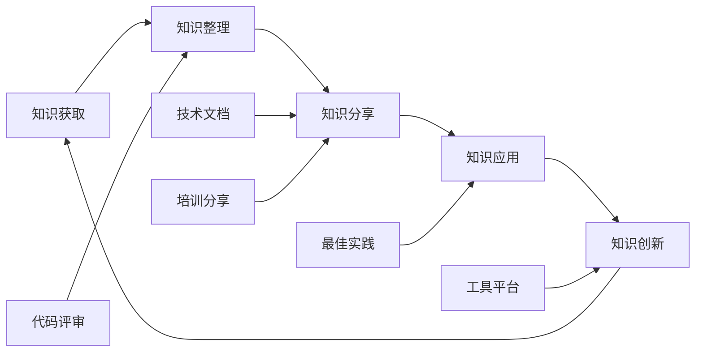

### 常见陷阱和解决方案

#### 架构反模式识别

| 反模式名称 | 症状描述 | 危害分析 | 解决方案 |
|------------|----------|----------|----------|
| 神类模式 | 单个类承担过多职责 | 难以维护、测试困难 | 应用单一职责原则拆分 |
| 复制粘贴编程 | 大量重复代码 | 维护成本高、错误传播 | 提取公共抽象和工具类 |
| 硬编码配置 | 配置值写死在代码中 | 灵活性差、难以调优 | 使用配置文件和数据驱动 |
| 循环依赖 | 模块间相互依赖 | 耦合度高、难以解耦 | 引入中介者或事件机制 |
| 过度设计 | 提前优化、过度抽象 | 复杂度高、开发效率低 | 按需设计、渐进式重构 |

## 结论

Unity 中的 C# 代码设计是一个系统性工程，需要在数据容器设计、接口驱动开发、组件化架构等多个维度上建立正确的设计理念。通过遵循 SOLID 原则，采用事件驱动和数据驱动的设计模式，结合 Unity 特性进行架构优化，可以构建出高质量、易维护、可扩展的游戏项目。

成功的架构设计不是一蹴而就的，而是需要在项目实践中不断演进和完善。关键在于建立正确的设计思维，掌握核心的设计原则，并在团队中形成良好的开发规范和知识传承机制。
