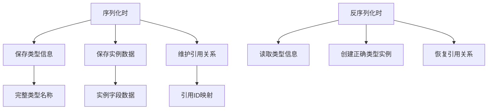
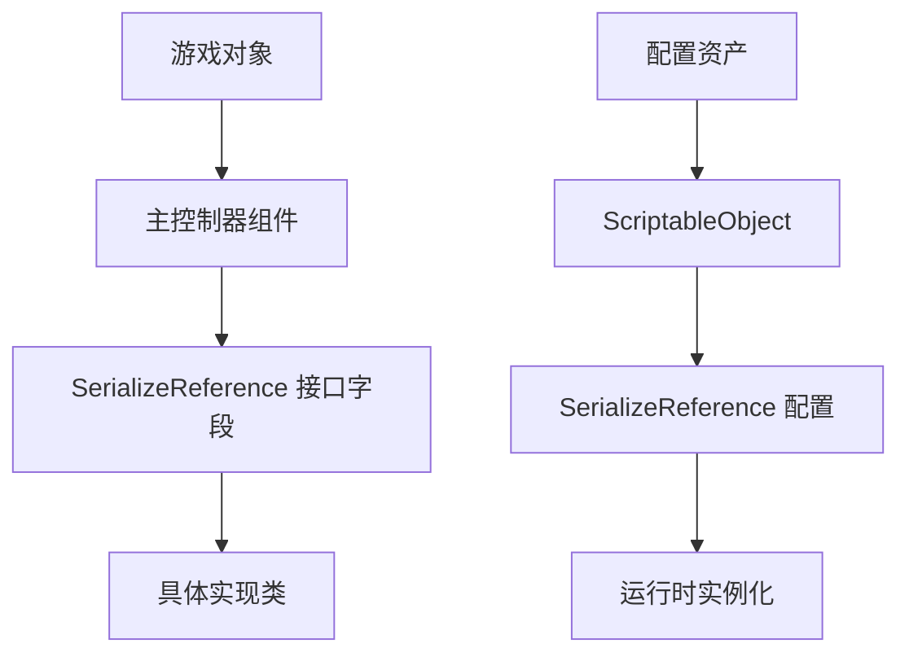

# Unity SerializeReferenceAttribute

## 概述

`SerializeReferenceAttribute` 是 Unity 2019.3 引入的重要特性，它彻底改变了 Unity 序列化系统对多态类型的支持。本文将深入探讨这个特性的使用方法、实现原理以及在游戏开发中的实际应用。

<!-- more -->

## SerializeReferenceAttribute 基础

### 传统序列化的限制

在 `SerializeReferenceAttribute` 出现之前，Unity 的序列化系统存在以下限制：

```csharp
public class TraditionalSerializationExample : MonoBehaviour 
{
    [SerializeField] private IWeapon weapon;        // ❌ 无法序列化接口
    [SerializeField] private BaseEnemy enemy;       // ❌ 只能序列化具体类型
    [SerializeField] private List<ISkill> skills;   // ❌ 接口集合无法序列化
}
```

这些限制导致开发者难以实现真正的多态设计，往往需要使用复杂的工厂模式或枚举驱动的实现。

### SerializeReferenceAttribute 的解决方案

```csharp
public class ModernSerializationExample : MonoBehaviour 
{
    [SerializeReference] private IWeapon weapon;        // ✅ 可以序列化接口实现
    [SerializeReference] private BaseEnemy enemy;       // ✅ 支持多态序列化
    [SerializeReference] private List<ISkill> skills;   // ✅ 接口集合完全支持
}
```

## 核心特性分析

### 引用序列化 vs 值序列化

| 特性对比   | SerializeField | SerializeReference |
| ---------- | -------------- | ------------------ |
| 序列化方式 | 值拷贝         | 引用序列化         |
| 类型支持   | 具体类型       | 接口/抽象类        |
| 多态支持   | ❌              | ✅                  |
| 空值处理   | 默认构造       | 支持 null          |
| 引用共享   | ❌              | ✅                  |
| 性能开销   | 低             | 中等               |

### 实现原理

`SerializeReferenceAttribute` 的工作机制包括：



## 实际应用场景

### 武器系统设计

#### 接口定义

```csharp
public interface IWeapon
{
    string Name { get; }
    float Damage { get; }
    float FireRate { get; }
    void Fire(Vector3 firePoint, Vector3 direction);
    bool CanFire();
}

public interface IReloadable
{
    int CurrentAmmo { get; }
    int MaxAmmo { get; }
    void Reload();
    bool NeedsReload();
}
```

#### 具体实现

```csharp
[System.Serializable]
public class Pistol : IWeapon, IReloadable
{
    [SerializeField] private string weaponName = "手枪";
    [SerializeField] private float damage = 25f;
    [SerializeField] private float fireRate = 2f;
    [SerializeField] private int currentAmmo = 12;
    [SerializeField] private int maxAmmo = 12;
    
    public string Name => weaponName;
    public float Damage => damage;
    public float FireRate => fireRate;
    public int CurrentAmmo => currentAmmo;
    public int MaxAmmo => maxAmmo;
    
    public void Fire(Vector3 firePoint, Vector3 direction)
    {
        if (!CanFire()) return;
        
        currentAmmo--;
        // 发射逻辑
        Debug.Log($"{weaponName} 发射！剩余弹药：{currentAmmo}");
    }
    
    public bool CanFire() => currentAmmo > 0;
    
    public void Reload()
    {
        currentAmmo = maxAmmo;
        Debug.Log($"{weaponName} 重新装弹完成");
    }
    
    public bool NeedsReload() => currentAmmo == 0;
}

[System.Serializable]
public class Rifle : IWeapon, IReloadable
{
    [SerializeField] private string weaponName = "步枪";
    [SerializeField] private float damage = 45f;
    [SerializeField] private float fireRate = 5f;
    [SerializeField] private int currentAmmo = 30;
    [SerializeField] private int maxAmmo = 30;
    
    // 实现与 Pistol 类似...
    public string Name => weaponName;
    public float Damage => damage;
    public float FireRate => fireRate;
    public int CurrentAmmo => currentAmmo;
    public int MaxAmmo => maxAmmo;
    
    public void Fire(Vector3 firePoint, Vector3 direction)
    {
        if (!CanFire()) return;
        
        currentAmmo--;
        Debug.Log($"{weaponName} 连射！剩余弹药：{currentAmmo}");
    }
    
    public bool CanFire() => currentAmmo > 0;
    public void Reload() => currentAmmo = maxAmmo;
    public bool NeedsReload() => currentAmmo == 0;
}
```

#### 武器控制器

```csharp
public class WeaponController : MonoBehaviour
{
    [SerializeReference] private IWeapon primaryWeapon;
    [SerializeReference] private IWeapon secondaryWeapon;
    [SerializeReference] private List<IWeapon> weaponInventory = new List<IWeapon>();
    
    [SerializeField] private Transform firePoint;
    [SerializeField] private LayerMask targetLayers;
    
    private IWeapon currentWeapon;
    
    private void Start()
    {
        currentWeapon = primaryWeapon;
    }
    
    private void Update()
    {
        HandleInput();
    }
    
    private void HandleInput()
    {
        if (Input.GetMouseButtonDown(0))
        {
            FireCurrentWeapon();
        }
        
        if (Input.GetKeyDown(KeyCode.R))
        {
            ReloadCurrentWeapon();
        }
        
        if (Input.GetKeyDown(KeyCode.Q))
        {
            SwitchWeapon();
        }
    }
    
    private void FireCurrentWeapon()
    {
        if (currentWeapon?.CanFire() == true)
        {
            Vector3 fireDirection = Camera.main.transform.forward;
            currentWeapon.Fire(firePoint.position, fireDirection);
        }
    }
    
    private void ReloadCurrentWeapon()
    {
        if (currentWeapon is IReloadable reloadable && reloadable.NeedsReload())
        {
            reloadable.Reload();
        }
    }
    
    private void SwitchWeapon()
    {
        currentWeapon = currentWeapon == primaryWeapon ? secondaryWeapon : primaryWeapon;
        Debug.Log($"切换到武器：{currentWeapon?.Name}");
    }
    
    public void AddWeapon(IWeapon weapon)
    {
        weaponInventory.Add(weapon);
    }
    
    public void EquipWeapon(IWeapon weapon)
    {
        if (primaryWeapon == null)
            primaryWeapon = weapon;
        else if (secondaryWeapon == null)
            secondaryWeapon = weapon;
        else
            primaryWeapon = weapon; // 替换主武器
            
        currentWeapon = weapon;
    }
}
```

### 技能系统设计

#### 技能接口层次

```csharp
public interface ISkill
{
    string Name { get; }
    string Description { get; }
    float Cooldown { get; }
    float ManaCost { get; }
    bool CanActivate();
    void Activate(GameObject caster);
}

public interface ITargetedSkill : ISkill
{
    float Range { get; }
    bool IsValidTarget(GameObject target);
    void ActivateOnTarget(GameObject caster, GameObject target);
}

public interface IAreaSkill : ISkill
{
    float Radius { get; }
    void ActivateInArea(GameObject caster, Vector3 center);
}
```

#### 具体技能实现

```csharp
[System.Serializable]
public class FireballSkill : ITargetedSkill
{
    [SerializeField] private string skillName = "火球术";
    [SerializeField] private string description = "发射一个火球攻击目标";
    [SerializeField] private float cooldown = 3f;
    [SerializeField] private float manaCost = 20f;
    [SerializeField] private float range = 10f;
    [SerializeField] private float damage = 50f;
    
    private float lastActivateTime;
    
    public string Name => skillName;
    public string Description => description;
    public float Cooldown => cooldown;
    public float ManaCost => manaCost;
    public float Range => range;
    
    public bool CanActivate()
    {
        return Time.time >= lastActivateTime + cooldown;
    }
    
    public void Activate(GameObject caster)
    {
        // 自动寻找最近目标
        var target = FindNearestEnemy(caster);
        if (target != null && IsValidTarget(target))
        {
            ActivateOnTarget(caster, target);
        }
    }
    
    public bool IsValidTarget(GameObject target)
    {
        return target.CompareTag("Enemy");
    }
    
    public void ActivateOnTarget(GameObject caster, GameObject target)
    {
        if (!CanActivate()) return;
        
        lastActivateTime = Time.time;
        
        // 创建火球效果
        CreateFireballEffect(caster.transform.position, target.transform.position);
        
        // 对目标造成伤害
        var health = target.GetComponent<Health>();
        health?.TakeDamage(damage);
        
        Debug.Log($"{skillName} 命中 {target.name}，造成 {damage} 点伤害");
    }
    
    private GameObject FindNearestEnemy(GameObject caster)
    {
        var enemies = GameObject.FindGameObjectsWithTag("Enemy");
        GameObject nearest = null;
        float nearestDistance = float.MaxValue;
        
        foreach (var enemy in enemies)
        {
            float distance = Vector3.Distance(caster.transform.position, enemy.transform.position);
            if (distance < nearestDistance && distance <= range)
            {
                nearestDistance = distance;
                nearest = enemy;
            }
        }
        
        return nearest;
    }
    
    private void CreateFireballEffect(Vector3 start, Vector3 end)
    {
        // 创建火球视觉效果的逻辑
        Debug.Log($"火球从 {start} 飞向 {end}");
    }
}

[System.Serializable]
public class HealingSkill : ISkill
{
    [SerializeField] private string skillName = "治疗术";
    [SerializeField] private string description = "恢复生命值";
    [SerializeField] private float cooldown = 5f;
    [SerializeField] private float manaCost = 30f;
    [SerializeField] private float healAmount = 75f;
    
    private float lastActivateTime;
    
    public string Name => skillName;
    public string Description => description;
    public float Cooldown => cooldown;
    public float ManaCost => manaCost;
    
    public bool CanActivate()
    {
        return Time.time >= lastActivateTime + cooldown;
    }
    
    public void Activate(GameObject caster)
    {
        if (!CanActivate()) return;
        
        lastActivateTime = Time.time;
        
        var health = caster.GetComponent<Health>();
        if (health != null)
        {
            health.Heal(healAmount);
            Debug.Log($"{skillName} 恢复了 {healAmount} 点生命值");
        }
    }
}
```

#### 技能管理器

```csharp
public class SkillManager : MonoBehaviour
{
    [SerializeReference] private List<ISkill> availableSkills = new List<ISkill>();
    [SerializeReference] private List<ISkill> equippedSkills = new List<ISkill>();
    
    [SerializeField] private int maxEquippedSkills = 4;
    [SerializeField] private PlayerMana playerMana;
    
    private void Update()
    {
        HandleSkillInput();
    }
    
    private void HandleSkillInput()
    {
        if (Input.GetKeyDown(KeyCode.Alpha1)) ActivateSkill(0);
        if (Input.GetKeyDown(KeyCode.Alpha2)) ActivateSkill(1);
        if (Input.GetKeyDown(KeyCode.Alpha3)) ActivateSkill(2);
        if (Input.GetKeyDown(KeyCode.Alpha4)) ActivateSkill(3);
    }
    
    public void ActivateSkill(int skillIndex)
    {
        if (skillIndex < 0 || skillIndex >= equippedSkills.Count) return;
        
        var skill = equippedSkills[skillIndex];
        if (skill == null) return;
        
        if (!skill.CanActivate())
        {
            Debug.Log($"{skill.Name} 冷却中");
            return;
        }
        
        if (playerMana.CurrentMana < skill.ManaCost)
        {
            Debug.Log($"法力值不足，无法释放 {skill.Name}");
            return;
        }
        
        playerMana.ConsumeMana(skill.ManaCost);
        skill.Activate(gameObject);
    }
    
    public bool EquipSkill(ISkill skill)
    {
        if (equippedSkills.Count >= maxEquippedSkills)
        {
            Debug.Log("技能栏已满");
            return false;
        }
        
        if (!availableSkills.Contains(skill))
        {
            Debug.Log("技能未解锁");
            return false;
        }
        
        equippedSkills.Add(skill);
        Debug.Log($"装备技能：{skill.Name}");
        return true;
    }
    
    public void UnequipSkill(ISkill skill)
    {
        if (equippedSkills.Remove(skill))
        {
            Debug.Log($"卸下技能：{skill.Name}");
        }
    }
    
    public void LearnSkill(ISkill skill)
    {
        if (!availableSkills.Contains(skill))
        {
            availableSkills.Add(skill);
            Debug.Log($"学会新技能：{skill.Name}");
        }
    }
}
```

## 高级使用技巧

### 引用共享

`SerializeReference` 支持引用共享，多个字段可以引用同一个对象：

```csharp
public class ReferenceSharing : MonoBehaviour
{
    [SerializeReference] private IWeapon playerWeapon;
    [SerializeReference] private IWeapon droppedWeapon;
    
    // 两个字段可以引用同一个武器对象
    private void Start()
    {
        var sharedWeapon = new Pistol();
        playerWeapon = sharedWeapon;
        droppedWeapon = sharedWeapon; // 共享引用
        
        // 修改其中一个会影响另一个
        if (playerWeapon is Pistol pistol)
        {
            pistol.Fire(Vector3.zero, Vector3.forward);
            // droppedWeapon 的弹药也会减少
        }
    }
}
```

### 空值处理

```csharp
public class NullHandling : MonoBehaviour
{
    [SerializeReference] private IWeapon weapon; // 可以为 null
    
    private void Update()
    {
        // 安全的空值检查
        if (weapon?.CanFire() == true)
        {
            weapon.Fire(transform.position, transform.forward);
        }
    }
    
    public void EquipWeapon(IWeapon newWeapon)
    {
        weapon = newWeapon; // 可以赋值为 null 来卸下武器
    }
}
```

### 类型过滤

使用 `SubclassSelector` 特性（需要 Odin Inspector）来限制可选择的类型：

```csharp
public class TypeFiltering : MonoBehaviour
{
    [SerializeReference, SubclassSelector]
    private IWeapon restrictedWeapon; // 只显示 IWeapon 的实现类
    
    [SerializeReference]
    [SubclassSelector(IncludeBaseType = false)]
    private BaseEnemy enemyType; // 排除基类，只显示派生类
}
```

## 性能考量

### 序列化性能

| 操作类型 | 相对性能 | 影响因素         |
| -------- | -------- | ---------------- |
| 序列化   | 85%      | 类型信息存储开销 |
| 反序列化 | 80%      | 反射创建实例开销 |
| 内存占用 | 110%     | 额外的类型信息   |
| 加载时间 | 90%      | 类型解析开销     |

### 优化建议

1. **避免深度嵌套**：限制 `SerializeReference` 对象的嵌套层次
2. **合理使用缓存**：缓存频繁访问的接口实现
3. **类型预热**：在游戏启动时预先创建常用类型实例
4. **批量序列化**：将相关对象组合到容器中一起序列化

```csharp
// 推荐：批量序列化
[System.Serializable]
public class WeaponLoadout
{
    [SerializeReference] public List<IWeapon> weapons;
    [SerializeReference] public List<ISkill> skills;
}

public class OptimizedPlayerController : MonoBehaviour
{
    [SerializeReference] private WeaponLoadout loadout; // 批量序列化
    
    // 避免：大量独立的 SerializeReference 字段
}
```

## 常见问题与解决方案

### 问题1：接口在 Inspector 中显示为 None

**原因**：没有具体的实现类或类型不可序列化

**解决方案**：

```csharp
// 确保实现类标记为 [System.Serializable]
[System.Serializable]
public class SwordWeapon : IWeapon
{
    // 实现内容...
}
```

### 问题2：序列化后数据丢失

**原因**：类型重命名或命名空间变更

**解决方案**：

```csharp
// 使用 FormerlySerializedAs 特性保持兼容性
[System.Serializable]
public class RenamedWeapon : IWeapon
{
    [FormerlySerializedAs("oldFieldName")]
    [SerializeField] private float newFieldName;
}
```

### 问题3：运行时性能问题

**原因**：频繁的类型检查和转换

**解决方案**：

```csharp
public class PerformanceOptimized : MonoBehaviour
{
    [SerializeReference] private IWeapon weapon;
    
    // 缓存类型检查结果
    private IReloadable reloadableWeapon;
    private bool isReloadable;
    
    private void Start()
    {
        // 启动时进行类型检查并缓存
        reloadableWeapon = weapon as IReloadable;
        isReloadable = reloadableWeapon != null;
    }
    
    private void Update()
    {
        // 使用缓存的结果，避免重复类型检查
        if (isReloadable && reloadableWeapon.NeedsReload())
        {
            reloadableWeapon.Reload();
        }
    }
}
```

## 与 Odin Inspector 的协同

`Odin Inspector` 进一步增强了 `SerializeReference` 的功能：

### 增强的类型选择器

```csharp
public class OdinEnhanced : SerializedMonoBehaviour
{
    [SerializeReference, SubclassSelector]
    private IWeapon weapon; // 友好的类型选择下拉菜单
    
    [SerializeReference, ShowInInspector]
    private List<ISkill> skills; // 支持复杂集合的可视化编辑
}
```

### 自定义绘制器

```csharp
public class WeaponDrawer : OdinAttributeDrawer<WeaponAttribute>
{
    protected override void DrawPropertyLayout(GUIContent label)
    {
        // 自定义武器字段的绘制方式
        Property.Draw(label);
        
        if (Property.ValueEntry.SmartValue is IWeapon weapon)
        {
            EditorGUILayout.LabelField($"伤害: {weapon.Damage}");
            EditorGUILayout.LabelField($"射速: {weapon.FireRate}");
        }
    }
}
```

## 最佳实践总结

### 设计原则

1. **接口优先**：优先设计接口，后实现具体类
2. **职责单一**：每个接口专注于单一职责
3. **组合优于继承**：通过接口组合实现复杂功能
4. **数据驱动**：将配置数据与行为逻辑分离

### 代码规范

```csharp
// ✅ 推荐的命名和结构
public interface IGameplayElement
{
    string DisplayName { get; }
    bool IsActive { get; }
    void Initialize();
    void Cleanup();
}

[System.Serializable]
public class ConcreteGameplayElement : IGameplayElement
{
    [SerializeField] private string displayName;
    [SerializeField] private bool isActive = true;
    
    public string DisplayName => displayName;
    public bool IsActive => isActive;
    
    public void Initialize()
    {
        // 初始化逻辑
    }
    
    public void Cleanup()
    {
        // 清理逻辑
    }
}
```

### 架构建议



## 结语

`SerializeReferenceAttribute` 为 Unity 开发带来了真正的多态序列化能力，使得我们能够构建更加灵活、可扩展的游戏架构。通过合理使用这个特性，结合良好的接口设计和组件化思维，可以大大提升代码的可维护性和扩展性。

在实际项目中，建议：

1. **渐进式采用**：从简单的系统开始使用，逐步扩展到复杂场景
2. **性能监控**：注意序列化性能，在必要时进行优化
3. **团队培训**：确保团队成员理解接口设计和多态序列化的概念
4. **工具支持**：配合 Odin Inspector 等工具提升开发体验

通过掌握 `SerializeReferenceAttribute`，我们能够编写出更加优雅、灵活的 Unity 代码，为游戏开发带来新的可能性。

---

*本文是 Odin Toolkits 系列文章的一部分，致力于分享 Unity 开发中的最佳实践和进阶技巧。*