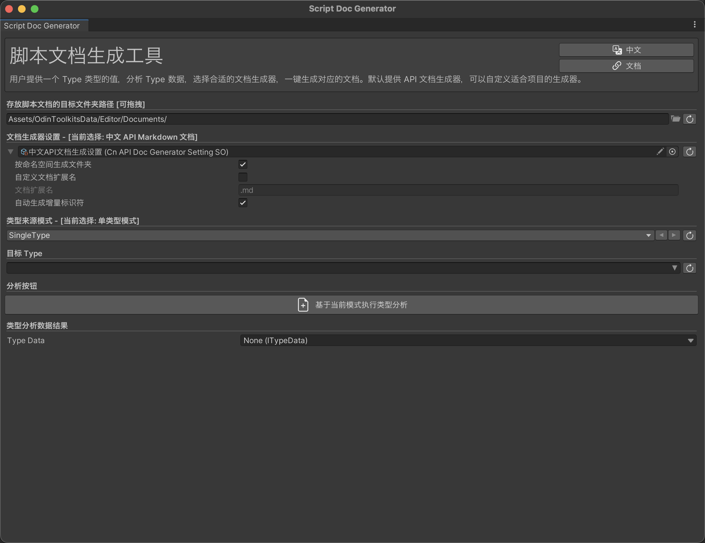
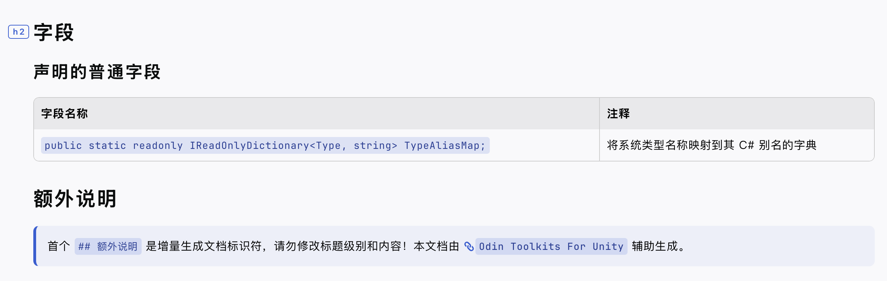
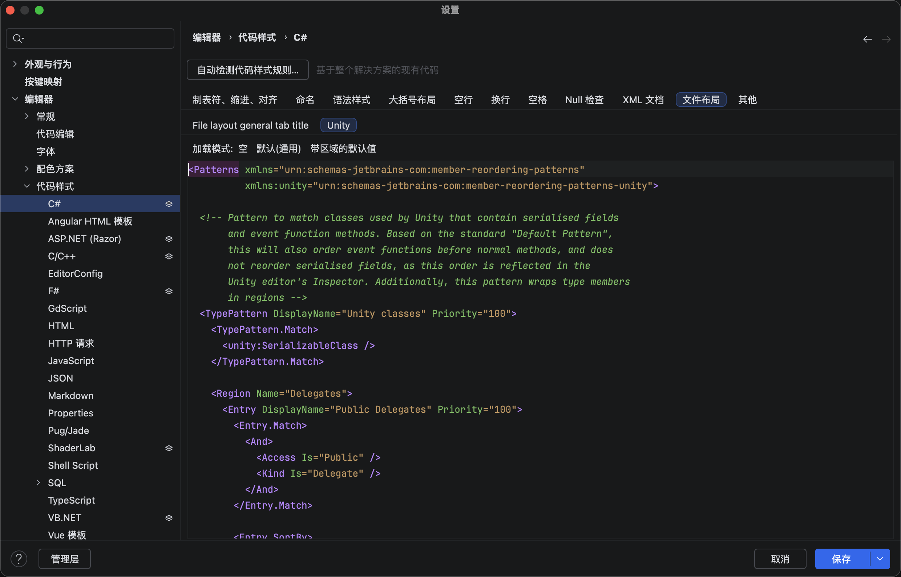

# Script Doc Generator 使用指南

## 简介

Script Doc Generator 是 Odin Toolkits For Unity 的核心模块之一，快捷生成代码注释文档。

### 核心特性

1. 支持单个类型、多个类型或整个程序集的文档批量生成。
2. 支持脚本文档增量生成，默认保留文档中 “## 额外说明” 后的内容，不覆盖生成。
3. 支持分析源代码中声明的类，以及类包含的构造函数、方法、事件、属性、字段。

## 开始使用

### 源代码要求

Script Doc Generator 主要依靠 `Reflection` 反射。注释采用的是读取 `[Summary("xxx")]` 的值的方案。因此，要求源代码中给需要生成注释的成员添加 `[Summary]` 。

#### SummaryProcessorMenuItems

为了更方便地使用工具，设计了 `SummaryProcessorMenuItems` 右键菜单。

提供了三个右键选项，当选择的资源中包含脚本文件时，可以选择执行。

1. Sync SummaryAttribute。读取 XML 注释中的 `
` 内容，添加`[Summary("xxx")]` 特性到成员上方。
2. Replace SummaryAttribute。读取 XML 注释中的 `
` 内容，删除 XML 的 `
` 内容，然后添加 `[Summary("xxx")]` 特性到成员上方。
3. Remove SummaryAttribute。移除选择的脚本源代码中的 `[Summary("xxx")]` 特性。

为了正确添加 `[Summary]` 特性，在执行操作前，推荐使用 IDE 对代码进行格式化。最好设置为特性和成员永不在同一行，以 Rider 举例。

### 打开工具面板

通过 Unity 编辑器菜单打开：Tools/Odin Toolkits/Script Doc Generator。

### 设置文档保存路径

在工具窗口的 “存放脚本文档的目标文件夹路径” 输入框中，设置文档导出根目录

- 支持绝对路径输入
- 支持拖拽文件夹到输入框快速设置
- 若路径不存在，生成时会提示自动创建文件夹

### 文档生成器设置

默认提供中文 API 文档生成器 `CnAPIDocGeneratorSettingSO`，可生成包含中文注释的 Markdown 文档。

如需自定义文档格式，声明一个继承自 `DocGeneratorSettingSO` 的类，实现 `GetGeneratedDoc` 方法，生成 SO 资源文件并更换文档生成设置资源文件。

#### DocGeneratorSettingSO

1. 是否按命名空间生成文件夹
2. 是否使用自定义文档扩展名
   1. 文档扩展名设置
3. 是否自动生成增量标识符

#### 中文 API 脚本文档结构（默认提供的 DocGeneratorSettingSO）

1. 类型名
2. 类型类别（如 class、struct，是否静态 / 抽象）
3. 所在程序集
4. 命名空间
5. 类型声明代码（如 `public class TestClass : MonoBehaviour`）
6. 注释（读取源代码中的 SummaryAttribute 的值）
7. 构造方法表格形式展示公共实例构造函数的签名及注释。
8. 非构造方法按 “声明的普通方法”“继承的普通方法”“运算符特殊方法” 分类，展示方法签名、注释及声明类。
9. 事件按 “声明的事件”“继承的事件” 分类，展示事件名称及注释。
10. 属性按 “声明的属性”“继承的属性” 分类，展示属性签名及注释。
11. 字段按 “声明的字段”“继承的字段” 分类，展示字段签名及注释。
12. 额外说明标识符，持久保留在标识符后的自定义内容（增量生成时不覆盖）。

### 选择类型来源

在 “类型来源” 选项中，选择需要生成文档的目标范围。

#### SingleType 单个目标类型

#### MultipleTypes 多个类型

多类型模式有两种类型提供方式。

第一种是 TypeCacheSO 资源，内部有一个类型列表，可以把多个类型的列表持久化存储，比如某个命名空间下的类，之后如果同时修改了多个类，那么可以直接使用这个资源文件，重新生成这些类的脚本文档。

同时，在选择了 TypeCacheSO 资源后，临时的 Type 列表将会隐藏。

其中一种是临时的列表，逐个添加类型。

提供了快捷生成 TypeCacheSO 的解决方案，首次添加列表后，点击保存为 SO 资源，可以一键把该临时列表存储到一个新的 TypeCacheSO 中去。

另外，可以自定义新生成 TypeCacheSO 资源的文件夹，点击自定义资源存储位置，即可出现路径设置。点击完成设置后，将会隐藏。

#### SingleAssembly 单个程序集

单程序集和多类型模式本质一样，不过是选择程序集后，工具将会收集该程序集中包含的所有的类。

### 分析类型

点击按钮分析设置的 Type 类型。

可以在类型分析数据结果中查看具体信息。

### 生成文档

在分析类型完成后，将会自动显示生成按钮，点击后，执行生成文档。

#### SingleType 单类型

1. 若目标类型已标记为 “过时”，会提示确认是否继续生成。
2. 生成文档后，自动用默认程序打开文档，并刷新 Unity 资源面板
3. 若目标路径已存在同名文档，会提示是否覆盖（覆盖时保留 “## 额外说明” 后的内容）

#### MultipleTypes 和 SingleAssembly

生成文档后，将自动打开存放文档的文件夹路径。

### 文档结果预览

### Rider 格式化设置推荐

#### 设置脚本文件布局

推荐使用**带区域的默认值**。

#### 快捷键

InteliJ 默认快捷键：

##### MacOS

++shift+option+command+"L"++

打开重新设置代码格式选择面板，没有自定义格式的话，选择完全清理即可。

### 已知限制

!!! warning

    1. 不支持分析 `unsafe` 代码。
    2. 不支持获取实例成员的默认值。

### 常见问题

Q：生成的文档缺少某些成员？

A：工具只解析公共构造函数，以及用户定义的成员，已经剔除程序集自动生成的成员。

Q：如何自定义生成的脚本文档格式？

A：声明一个继承自 `DocGeneratorSettingSO` 的类，实现 `GetGeneratedDoc` 方法，更换文档生成设置资源文件。

### 推荐阅读

- [ScriptDocGenerator 单元测试](../ScriptDocGenerator/UnitTestSupports.md)
